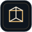

 

**I build Minecraft systems that are meant to feel like parts of one game: combat, UI, progression, multiplayer state, server infrastructure, animation and world design.**

 

<a href="#projects">Projects</a> ·
<a href="#live-development-dashboard">Live dashboard</a> ·
<a href="#currently-forging">Current focus</a> ·
<a href="#public-repositories">Public repositories</a> ·
<a href="#toolchain">Toolchain</a> ·
<a href="https://space.bilibili.com/38903099">Bilibili ↗</a>

 

## About

I'm **Axira**, an independent developer focused on Minecraft modding, action-RPG systems, multiplayer infrastructure, interface design, animation, and level/world design. My main development target is **Minecraft 1.21.1 with NeoForge**, with projects ranging from gameplay frameworks to long-term server systems.

The recurring engineering priorities are simple: important state stays server-authoritative, persistent data survives upgrades safely, compatibility remains intentional, and game feel matters as much as technical correctness.

## Live development dashboard

Generated from public GitHub repository data by this profile repository's own workflow. No third-party stats service is required for the dashboard.

## Projects

<table>
<tr>
<td width="50%" valign="top">

<h3>MaplesAdventure</h3>

<code>ACTIVE BUILD</code> · <code>NEOFORGE 1.21.1</code> · <code>SOULS-LIKE ACTION RPG</code>

A combat-and-exploration project built around deliberate action gameplay: lock-on, directional movement, boss encounters, multiplayer phasing, fog gates, progression, animation, and a connected world developed as one system.

<a href="#maplesadventure"><b>View project focus ↓</b></a>

</td>
<td width="50%" valign="top">

<h3>Maples;World</h3>

<code>LIVE WORLD</code> · <code>MULTIPLAYER</code> · <code>SERVER SYSTEMS</code>

A persistent Minecraft server ecosystem combining adventure content, Create-oriented play, custom economy and progression, achievements and titles, construction systems, administration tooling, and shared player systems.

<a href="#maplesworld"><b>View project focus ↓</b></a>

</td>
</tr>
<tr>
<td width="50%" valign="top">

<h3>RPG Menu Framework</h3>

<code>PUBLIC</code> · <code>JAVA</code> · <code>MIT</code>

An immersive RPG interface framework for modpack developers, designed to unify inventory, equipment, attributes, skills, magic, quests, and compatibility layers inside one coherent player interface.

<a href="https://github.com/Axira-A/RPG-Menu-Framework"><b>Open repository ↗</b></a>

</td>
<td width="50%" valign="top">

<h3>MaplesCore</h3>

<code>CORE SYSTEMS</code> · <code>SERVER AUTHORITY</code> · <code>PERSISTENCE</code>

The shared server-side systems layer behind economy, titles and achievements, administration, construction workflows, persistence, compatibility, and cross-server features for the Maples;World ecosystem.

<a href="#maplescore"><b>View project focus ↓</b></a>

</td>
</tr>
</table>

## Currently forging

### MaplesAdventure — current direction

Eight-direction movement and dodge feel, weapon animation weight, boss encounter flow, non-linear exploration, multiplayer phasing, and the broader adventure-world pipeline are being developed together so combat and level design reinforce each other.

### Maples;World — current direction

The server layer continues to focus on progression, economy sinks, adventure infrastructure, cross-server player systems, administration workflows, and long-term maintainability for a small persistent community.

### MaplesCore — current direction

The core remains centered on server authority, safe persistence and migration, titles/achievements, economy, construction workflows, administration, and interoperable systems that can survive future server splits.

## Recent public signal

## Public repositories

The table below is maintained by the same GitHub Actions workflow that refreshes the dashboard. Tagged releases are shown when a featured repository has one; otherwise the channel stays marked as development.

<!-- AUTO:REPOSITORIES:START -->
| Repository | Stack | Channel | Branch | Last push |
|---|---|---|---|---|
| **[RPG-Menu-Framework](https://github.com/Axira-A/RPG-Menu-Framework)** A minecraft mod for modpack developers | `Java` · ★ 0 | development | `dev` | 2026-09-04 |
| **[Skydome-GM-Manager](https://github.com/Axira-A/Skydome-GM-Manager)** 自用游戏系统 | `TypeScript` · ★ 1 | development | `main` | 2025-12-17 |
| **[Vitalink-Wiki](https://github.com/Axira-A/Vitalink-Wiki)** 由Rutsunine主创的OC知识库网站 | `TypeScript` · ★ 0 | development | `main` | 2025-12-15 |
| **[originspore](https://github.com/Axira-A/originspore)** Public repository | `Java` · ★ 0 | development | `main` | 2026-07-01 |
<!-- AUTO:REPOSITORIES:END -->

<a href="https://github.com/Axira-A?tab=repositories"><b>Browse all public repositories →</b></a>

## Toolchain

<table>
<tr>
<td align="center" width="20%"> <b>Java 21</b> main modding language</td>
<td align="center" width="20%"> <b>NeoForge</b> Minecraft 1.21.1</td>
<td align="center" width="20%"> <b>KubeJS</b> server scripting</td>
<td align="center" width="20%"> <b>Gradle</b> build pipeline</td>
<td align="center" width="20%"> <b>Git</b> version control</td>
</tr>
<tr>
<td align="center"> <b>Actions</b> automation / CI</td>
<td align="center"> <b>Blender</b> animation</td>
<td align="center"> <b>Blockbench</b> voxel modeling</td>
<td align="center"> <b>Unity / C#</b> game-dev study</td>
<td align="center"> <b>Python</b> tooling / generation</td>
</tr>
</table>

## Automation health

The profile itself is treated like a small software project. The refresh workflow rebuilds live cards and public-repository metadata, while validation checks JSON configuration, local asset references, SVG integrity, script syntax, and accidental regressions back to raster-only UI.

- **Profile refresh:** scheduled daily, manually runnable, and triggered when profile configuration or generator code changes.
- **Validation:** runs on profile changes and pull requests; generated SVGs must remain parseable and self-contained.
- **Failure behavior:** if GitHub API data is temporarily unavailable, the last valid live cards are preserved instead of replacing them with an error screen.

<b>Engineering principles</b>

 

| Principle | What it means here |
|---|---|
| **Game feel first** | A feature is not finished just because it technically functions. |
| **Server authority** | Important multiplayer state should remain deterministic and trustworthy. |
| **Persistence** | Upgrades and migrations should preserve player progress safely. |
| **Compatibility** | Integrations should cooperate with a modpack instead of taking it over. |
| **Cohesion** | Mechanics, UI, animation, progression, and world design should feel like one game. |

Profile UI generated in-repository · live data refreshed by GitHub Actions · <a href="https://space.bilibili.com/38903099">Bilibili</a> · Axira-A

