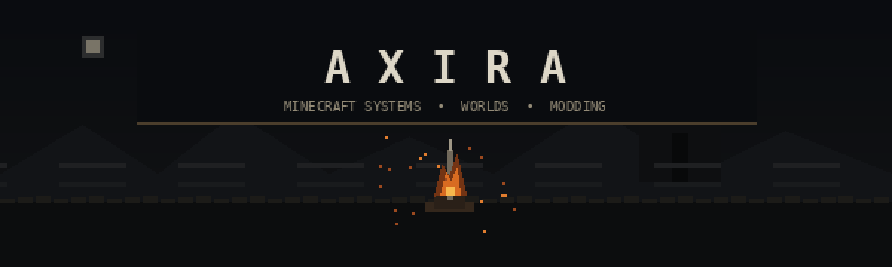

 

### Building worlds, combat systems, and tools inside Minecraft.

`Minecraft 1.21.1` · `NeoForge` · `Java 21` · `Game Systems` · `UI / UX` · `World Design`

## About

I'm **Axira**, an independent developer focused on Minecraft modding, multiplayer systems, RPG mechanics, and world design.

My work is centered on building complete gameplay experiences rather than isolated features: combat, progression, multiplayer rules, interfaces, persistence, compatibility, and the worlds that connect them.

## Featured work

<table>
<tr>
<td width="50%" valign="top">
<h3>⚔️ MaplesAdventure</h3>

A Souls-like action RPG project for <strong>Minecraft 1.21.1 NeoForge</strong>.

Combat feel, lock-on and movement, multiplayer phasing, encounters, bosses, fog gates, progression, and exploration are designed as parts of one coherent adventure framework.

<strong>Focus:</strong> combat systems · multiplayer · bosses · progression

</td>
<td width="50%" valign="top">
<h3>🍁 Maples;World</h3>

A long-term multiplayer Minecraft world and server ecosystem.

Custom economy, achievements, titles, construction systems, server tooling, cross-system progression, Create integration, and adventure content are developed around a persistent shared world.

<strong>Focus:</strong> server systems · world design · economy · community gameplay

</td>
</tr>
<tr>
<td width="50%" valign="top">
<h3>🧭 RPG Menu Framework</h3>

An immersive RPG-style interface framework designed to bring inventory, equipment, attributes, skills, magic, quests, and mod integrations into a unified player experience.

<strong>Focus:</strong> UI / UX · equipment · attributes · compatibility

</td>
<td width="50%" valign="top">
<h3>🔧 MaplesCore</h3>

The technical foundation behind server-side and shared gameplay systems: economy, player progression, achievements, administration, project management, persistence, and cross-server features.

<strong>Focus:</strong> architecture · persistence · server authority · tooling

</td>
</tr>
</table>

[**Explore my public repositories →**](https://github.com/Axira-A?tab=repositories)

## Currently forging

This panel is generated inside this repository by **GitHub Actions**. It does not depend on an external profile-stat service.

## Equipped tools

`Java 21` · `NeoForge` · `Gradle` · `Git` · `KubeJS`  
`Blockbench` · `Blender` · `Unity / C#` · `Minecraft Data & Resource Packs`

## What I care about

- **Game feel first** — systems should be satisfying to use, not merely technically complete.
- **Server authority** — important multiplayer state should remain trustworthy and deterministic.
- **Compatibility** — integrations should cooperate with the rest of a modpack instead of taking it over.
- **Persistence** — upgrades and migrations should not casually destroy player progress.
- **Cohesion** — UI, mechanics, world design, animation, and progression should feel like parts of the same game.

<b>Development interests</b>

 

Minecraft modding · Souls-like combat · action RPG systems · multiplayer architecture · UI / UX · game economy · animation · voxel modeling · world and level design · developer tooling

### Rest at the bonfire.

Thanks for visiting · Axira-A

