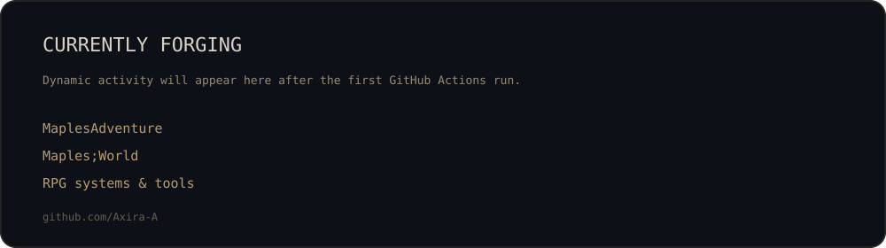

 

### Building worlds, combat systems, and tools that make Minecraft feel like a different game.

`Minecraft 1.21.1` · `NeoForge` · `Java 21` · `Game Systems` · `UI / UX` · `World Design`

[Public repositories](https://github.com/Axira-A?tab=repositories) · [RPG Menu Framework](https://github.com/Axira-A/RPG-Menu-Framework)

## About

I'm **Axira**, an independent developer focused on Minecraft modding, multiplayer systems, RPG mechanics, UI / UX, animation, and world design.

I like projects where individual features connect into a complete experience: combat and movement should agree with animation; progression should agree with encounter design; interfaces should agree with the rest of the game; multiplayer state should remain trustworthy and persistent.

## Select project

[MaplesAdventure](#maplesadventure) · [Maples;World](#maplesworld) · [RPG Menu Framework](#rpg-menu-framework) · [MaplesCore](#maplescore)

### MaplesAdventure

`IN DEVELOPMENT` · `NeoForge 1.21.1` · `Souls-like Action RPG`

A combat-and-exploration project built around deliberate action gameplay: lock-on, movement, encounters, bosses, multiplayer phasing, fog-gate encounters, progression, animation, and a connected world are developed as one system rather than isolated mechanics.

### Maples;World

`SERVER PROJECT` · `MULTIPLAYER` · `LONG-TERM WORLD`

A persistent Minecraft server ecosystem combining adventure content, Create-oriented play, custom economy and progression, achievements and titles, construction systems, server tooling, and shared player systems.

### RPG Menu Framework

`PUBLIC` · `JAVA` · `MIT`

An immersive RPG interface framework for modpack developers, designed to unify inventory, equipment, attributes, skills, magic, quests, and compatibility layers inside one coherent player interface.

**→ [Open the public repository](https://github.com/Axira-A/RPG-Menu-Framework)**

### MaplesCore

`IN DEVELOPMENT` · `SERVER AUTHORITY` · `PERSISTENCE`

The shared systems layer behind server-side gameplay: economy, progression, titles and achievements, administration, construction workflows, persistence, compatibility, and cross-server features.

## Currently forging

<table>
<tr>
<td width="28%"><strong>⚔ MaplesAdventure</strong></td>
<td>combat feel · encounters · bosses · world design · animation</td>
</tr>
<tr>
<td><strong>🧭 RPG Menu Framework</strong></td>
<td>equipment UX · mod integrations · controller / keyboard navigation</td>
</tr>
<tr>
<td><strong>🍁 Maples;World</strong></td>
<td>server systems · progression · economy · adventure infrastructure</td>
</tr>
</table>

## Latest public work

<b>How this panel works</b>

 

The card is generated by this profile repository's own **GitHub Actions** workflow. It reads my public repositories through the GitHub API, ignores forks / empty repositories / this profile repository, and refreshes only when the rendered card actually changes. No third-party profile-stat service is required.

## Equipped tools

`Java 21` · `NeoForge` · `KubeJS` · `Gradle` · `Git` · `Blender` · `Blockbench` · `Unity / C#`

## Engineering values

- **Game feel first** — a system is not finished just because it is technically functional.
- **Server authority** — important multiplayer state should remain deterministic and trustworthy.
- **Persistence** — upgrades and migrations should not casually destroy player progress.
- **Compatibility** — integrations should cooperate with a modpack instead of taking it over.
- **Cohesion** — mechanics, UI, animation, progression, and world design should feel like parts of the same game.

<b>More interests</b>

 

Minecraft modding · Souls-like combat · action RPG systems · multiplayer architecture · UI / UX · game economy · animation · voxel modeling · level / world design · developer tooling

Thanks for visiting · Axira-A

